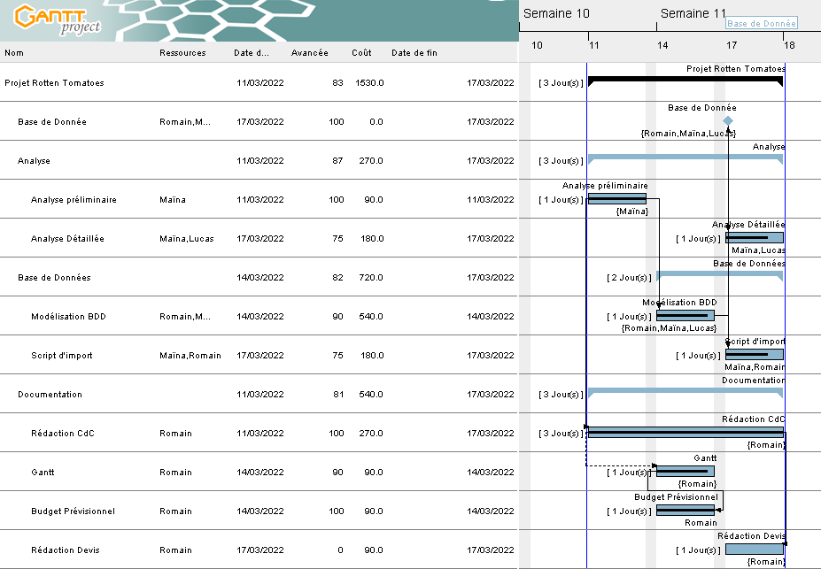
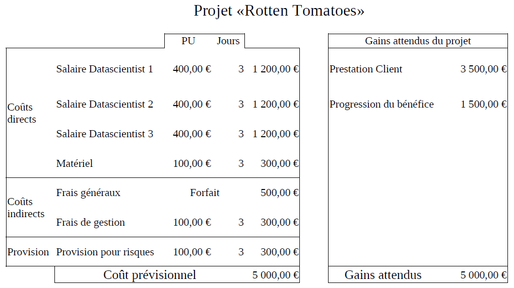
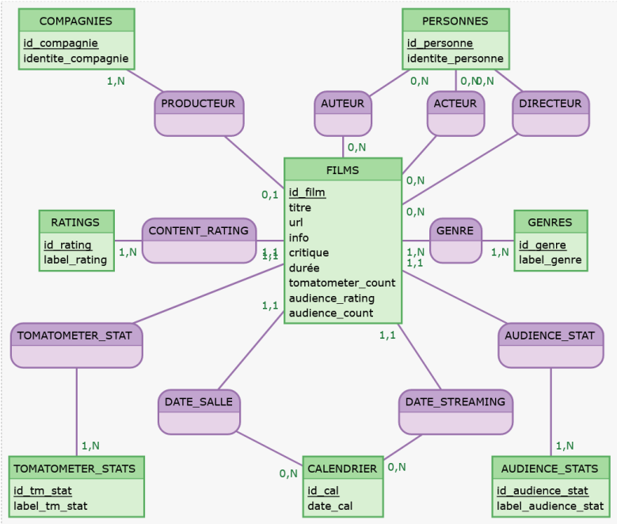

# Rotten_Tomatoes

Brief Analyse de Données

## Gestion de Projet

### État d'avancement du Projet

### Suivit financier

### Cahier des Charges

[Version Client](Cahier_des_Caharges.pdf)

## Analyse des données

Livrable Client : [Note-book Jupyter](brief_rotten_tomatoes.ipynb)

## Base de données

### Structure de la Base

[Structure de la base MySQL](SQL/Database/Rotten_Tomatoes_mysql.sql)

### Données

[Données à importer](tables/)

### Scripts d'imports

[imports des données en python (WIP)](Import/data_importer.py)]
