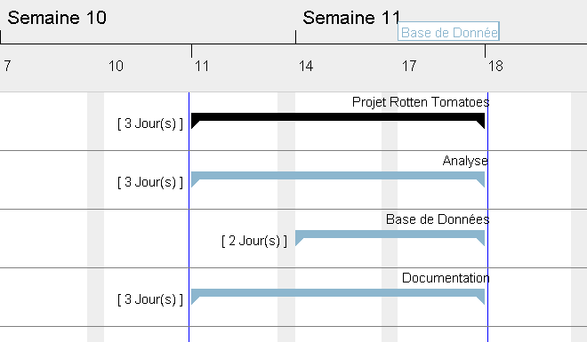

# Rotten_Tomatoes

Brief Analyse de Données

- Romain Heller
- Maïna Le Dem
- Lucas Lustosa

## Contexte

*Fandango* est une société américaine de billetterie qui vend des billets de cinéma par le biais de leur site internet ainsi que par leur application mobile.  

Depuis le rachat de *Flixter* à *Warner Bross* en 2016, c’est *Fandango* qui opère sa filiale *Rotten Tomatoes* et sa base de données répertoriant les critiques de films ou de DVD. 

*Fandango* aimerait pouvoir évaluer les possibilités d’exploitation de ces données afin d’en tirer d’autres sources de revenus complémentaires. 

## Gestion de Projet

### État d'avancement du Projet

L'avancement du projet est suivit grâce à un tableau de Gantt, reprenant les tâches à réaliser et les ressources affectées.

[Rapport complet](Gestion_de_Projet/Gantt-Rotten_Tomatoes.pdf) à date, à destination du comité de pilotage du projet.

### Budger Prévisionnel

### Cahier des Charges

Un [cahier des Charges](cahier_des_charges.pdf) Version Client, prêt à être signé.

## Analyse des données

Livrable Client : [Note-book Jupyter](brief_rotten_tomatoes.ipynb)

## Base de données

### Structure de la Base

- [Structure de la base MySQL](SQL/Database/Rotten_Tomatoes_mysql.sql)
- Une [prodédure stockée](SQL/procedure-get_acteurs_from_film_id.sql) qui renvoie, formatée en une chaine de caractère, la liste des acteurs séparés par une virgule.
- [Une Vue](SQL/view-v_pilotes.sql).

### Données

- [Données livrées](rotten_tomatoes_movies.csv) par le Client.
- [Données traitées](tables/) à importer.

### Scripts d'imports

- [Note-book Jupyter](brief_rotten_tomatoes.ipynb) pour l'import des données traitées.
- [Script d'import python (WIP)](Import/data_importer.py) pour les données brutes (version de développement).

## Prescriptions

L'analyse de la base fournie par le client a permit de mettre en évidence des corélations qui pouraient lui permettre de vendre du conseil à des prospects :

Problématiques proposées au client (préconisations, recommandations business):
- En tant que distributeur, quel est le nombre de vues espérées pour une compagnie ?
- En tant que compagnie, quel est le nombre de vues espérées pour un producteur ?
- En tant que producteur, quel est le nombre de vues espérées pour un auteur ?
- En tant que producteur, quel est le nombre de vues espérées pour un acteur ?
- En tant que cinema, quel est le nombre de places espérées pour un film ?
- En tant que cinema, quelle est la meilleure période pour programmer un film en fonction de sa catégorie ?

